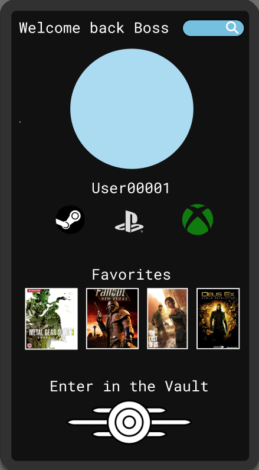
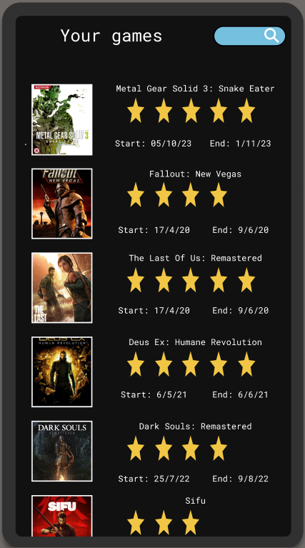
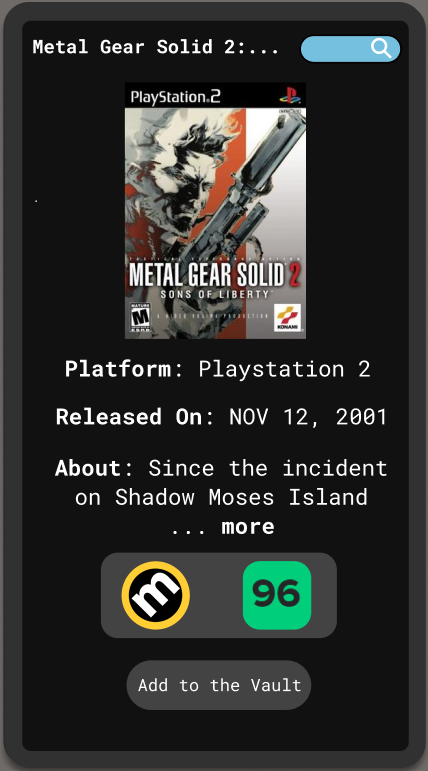
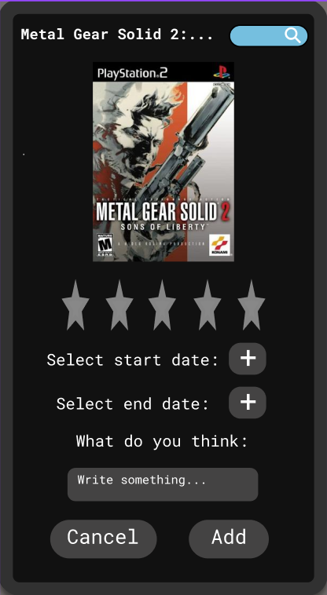

# Games Vault
### By Matteo Calvanico
#### Progetto per: Laboratorio di Programmazione di Sistemi Mobili 
## Idea
L'idea alla base è quella di fornire un'applicazione mobile per tenere traccia e recensire i videogames a cui si è giocato e scoprirne di nuovi.

Il servizio offerto è lo stesso del famoso portale [LetterBoxd](https://letterboxd.com) *(portale per recensire e tenere traccia di film)* senza la componente social, quindi non sarà possibile vedere i profili degli altri utenti.

## Nel dettaglio
### L'app avrà le seguenti funzionalità (obbligatorie):
- La possibilità di creare un account.
- Personalizzazione del profilo con:
  - foto;
  - username;
  - account di gioco (PSN, Steam, Xbox, ecc);
  - i quattro giochi preferiti.
- Indicare quali giochi abbiamo giocato e eventualmente aggiungere i seguenti dettagli:
  - la data di quando abbiamo iniziato a giocare e quando lo    abbiamo completato;
  - un voto da 1 a 5, rappresentato in stelle;
  - una breve recensione o un nostro pensiero sul titolo.
- Vedere tutti i giochi aggiunti nella sezione Vault.
- La ricerca dei giochi in base al titolo (grazie alle API fonite dal sito [Rawg](https://rawg.io/)).

### Funzionalità facoltative:
- [ ] Sezione per le notizie a tema videoludico.
- [ ] Giochi consigliati in base agli ultimi aggiunti.
- [ ] Possibilità di inserire nell'account i giochi posseduti su Steam (sarà necessario utilizzare le [API](https://developer.valvesoftware.com/wiki/Steam_Web_API#GetGlobalAchievementPercentagesForApp_.28v0001.29) fornite da Valve).
- [] Inserire i prossimi giochi che si vuole giocare nella sezione Wishlist

### Immagini prototipo

#### Home page

[FIGMA](https://www.figma.com/file/BDaSt0oGNPzH08eB5V8aJv/Game-Vault?type=design&node-id=0-1&mode=design&t=0B8sndX7UVuCMsGU-0)