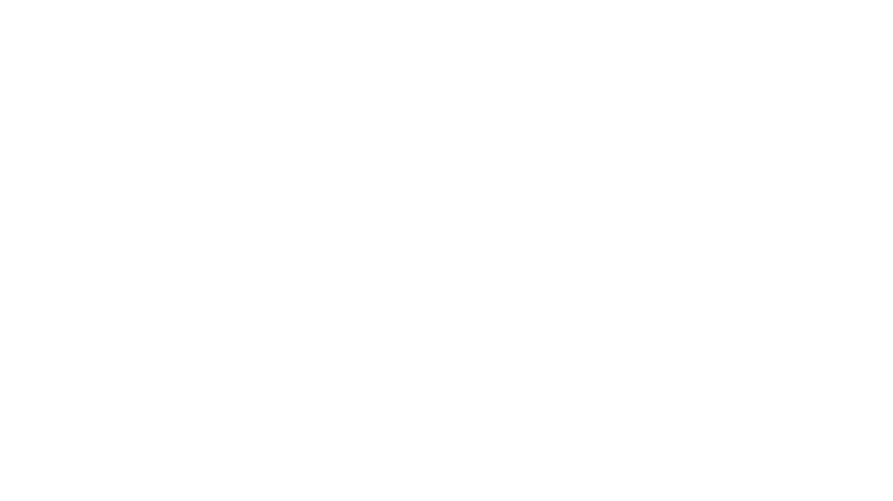
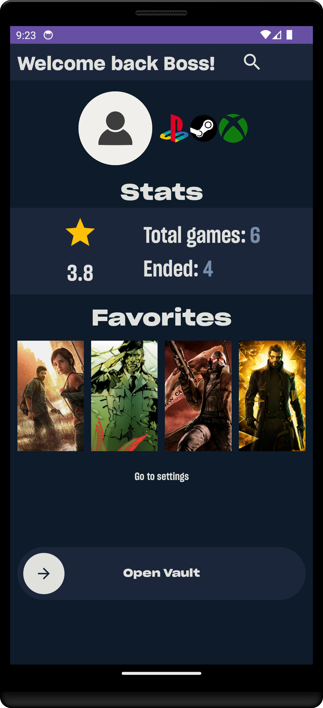

  

| Creator          |      Info                            |
|:----------:      |:-------------:                       |
| Matteo Calvanico |  matteo.calvanico@studio.unibo.it    |
| Filippo Monti    |    filippo.monti15@studio.unibo.it   |

### Project for: Laboratorio di Programmazione di Sistemi Mobili 

# Idea
Creating a mobile app to virtually track and rate your game collection.

The inspiration for the app is the site [LetterBoxd](https://letterboxd.com) where you can do the same things but with the movie.

# What the app can do

- Create and custom your profile with:

  - pfp;

  - game accounts (PSN, Steam, Xbox);

  - favorite games.

- Track the games you have played and save this information:

  - the date of when we started it and when we completed it;

  - a rating from 1 to 5, represented by stars;

- Look at all the games added to the Vault, and:

  - filter by name;

  - delete game with a swipe

- Search for a game by title or search for the entire series directly
 (powered by [Rawg](https://rawg.io/)).

# What the app will do:

- [ ] A search store section.

- [ ] A video game-based news section.

- [ ] Import games from Steam ([Valve API](https://developer.valvesoftware.com/wiki/Steam_Web_API#GetGlobalAchievementPercentagesForApp_.28v0001.29)).

- [ ] A whislist.

- [x] User stats, like: number of games added, average ratings, number of games finished.

- [ ] Online function (very unlikely).

# Screenshot from the app:

### Home page
<!---->

### Vault
<!---->

### Search
<!---->

### Game details
<!---->
<!---->

  
  

### Settings
<!---->

Game Vault © 2024 by Matteo Calvanico & Filippo Monti is licensed under CC BY-NC-SA 4.0. To view a copy of this license, visit https://creativecommons.org/licenses/by-nc-sa/4.0/

